###### MERN APP PART A
# Metascoop

### Purpose

Metascoop is a fully-functional web based application which provides users with an enjoyable and endlessly rewarding news, content and reading aggregator. Metascoop leverages the use of an external news API that enables metascoop to provide the meaningful delivery the most up to date, highest quality and most relevent content to it's users. The purpose of the site is to provide an alternative source and access point to news and content from around the web that doesn't need to be filtered through the lense of any algorithm, trends or social media. It's a pure point of enrty to the latest content from arouns the web and seeks to make online reading and content discovery smooth, unbiased, personalised and accessible. Users can sift through Publications, Authors, and Genres of their liking. The idea behind our application is to have users spend more time reading genuine sources of news and re-interest readers in making a habit out of seeking multiple sources to stay informed. With an ever-growing database of archived articles the news will never get stale for readers and our content will stay fresh and captivating.

Metascoop seeks to provide an enjoyable and streamlined user interface and user experience which allows it's users to meaningfully discover, manage and take control of the content they wish to engage with. Metascoop provides the tools nescessary to let users create their own daily digital newspaper and custom news feed. Metascoop includes several ways of storing and managing the content, including the 'Reading list' which allows users to build out their own daily digital newspaper, the Archive allows users to store articles in in a logical location for later viewing and some light data is captured from each user which allows for an enhanced and personlised experience whilst using the site.     

### Functionality and Features:

The MERN app is a fully featured and personalised web application. The MERN app revolves around the idea of providing an alternative stream of news, articles and content from around the web and delivering this content to the user in near real time. The MERN app uses an external API which provides the user with a content feed of the latest news and articles from around the web. The API request can be altered and manipulated so that a user can find news and articles based on category, by region or by searching. When viewing the content 'feed' individual articles of interest can be used in several different ways. A summary of an article can be displayed, articles can be stored in a daily ‘playlist’ and (if signed in) articles can be stored into a permanent archive for later viewing. The MERN app can be used by both registered and non registered users, however users who are signed in will have access to more features than non registered users. Users can create an account with a secure authentication system. Once a user is signed in they will have the ability to see their previous ‘daily playlists’,  but will also have the ability to store and save articles in their own custom archive folders. Registered users can also save their favourite custom searches and follow specific publications/domains. All of this info can be used to create a custom feed that is unique to individual users.

### Target audience 

The target audience ranges widely, and as the application seeks to give individuals the tools to make the website appealing and useful to their own needs, the target audience essentially encompasses almost any individual who uses the web to get their news. With the exponential growth of sites like Reddit, Facebook, Twitter, and similar purposed/formatted social media sites that users indulge in, we believe we have a pretty decent idea of who will buy into our concept. Taking into consideration the popularity and success of the aforementioned sites the style and layout of our website closely resembles that of something like Reddit, encouraging users to continually (seek) out new information and reuse the site. The reusability of the site stems from the endless and ever-growing article archive available through the API to ensure users aren’t faced with repetitive information or boring content. In saying all this the site will be neither overly complex nor intimidating to the older generations. We’ve styled it to be user-friendly and quite rigid so it can be easily accessed and enjoyed by users who are not proficient with the internet. Our site can also be marketable to the younger up-and-coming generations as the search potential is endless, meaning that youngsters can always look up things like gaming and sports news.

### Tech Stack

Metascoop is built using the standard MERN stack. To provide the latest and most up to date news and articles from around the web on Metascoop an external news API 'Currents' will be accessed. Another external API called 'Summarization' will also be used to generates a brief text summary of the any article upon request. MongoDB is pivotal to our application for its’ scalability and speed, and has been used to create our database and schemas. We’ve used Express as our backend framework to simplify the written back-end code components. React will be used to build out the frontend and user interface. Node.js is used by each of these components to provide the runtime enivronment for these different web technologies. The MongoDB database will be hosted on a 'Mongo Atlas' cloud cluster. The Express backend will be deoplyed on Heroku and the React front end will be deployed and hosted on Netlify. 

### Dataflow Diagram

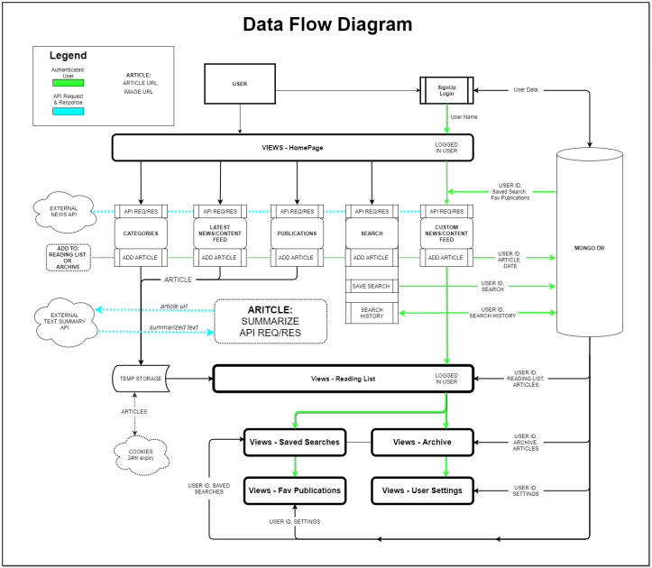

### Application Architecture Diagram

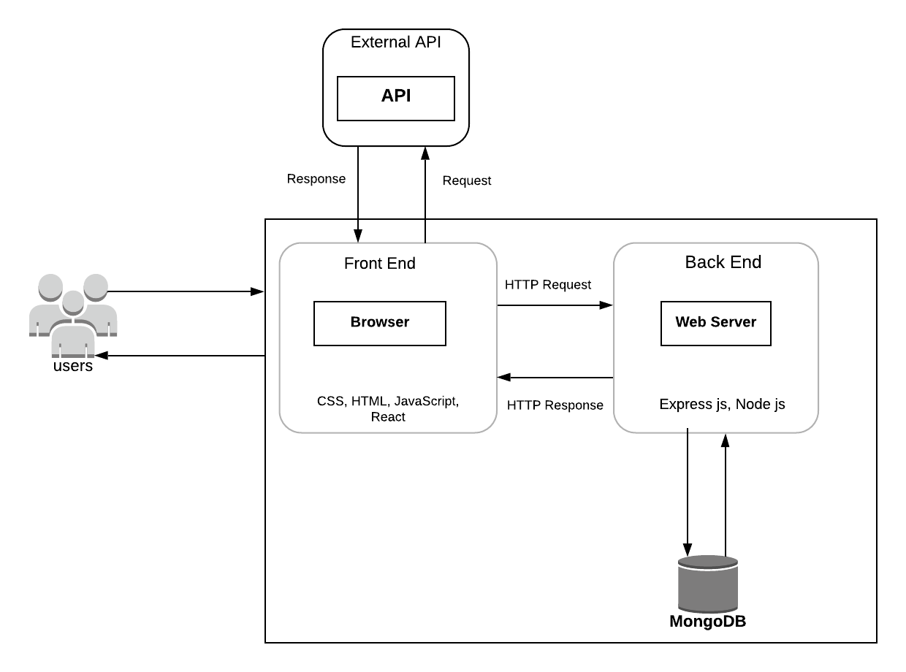

### User Stories

1. I should be able to trust the veracity and reliability of the news I’m reading. The site should provide be with genuine articles sourced from reputable sites and publications that will not mislead me. 
2. I should be able to sift through my personalised feed and recognise familiar pieces. I should be presented with the option to search via Author, Publication, or Genre. These should never be limited to a certain category and I should be able to change my preferences.
3. I should be able to archive my favoured articles that constantly occupy a permanent space where I can re-visit them and access them at will. Device deviation shouldn’t affect my personalised archive and I should be solely responsible for alterations made to it. 
4. I should have there ability to create a reading list (similar to a to do list) that I can re-visit and access articles. This should serve as a virtual list that I can alter to add items of particular interest to me and remove/archive them once I have finished.

### User Stories for Different Personas

##### User 1. Guy Incognito
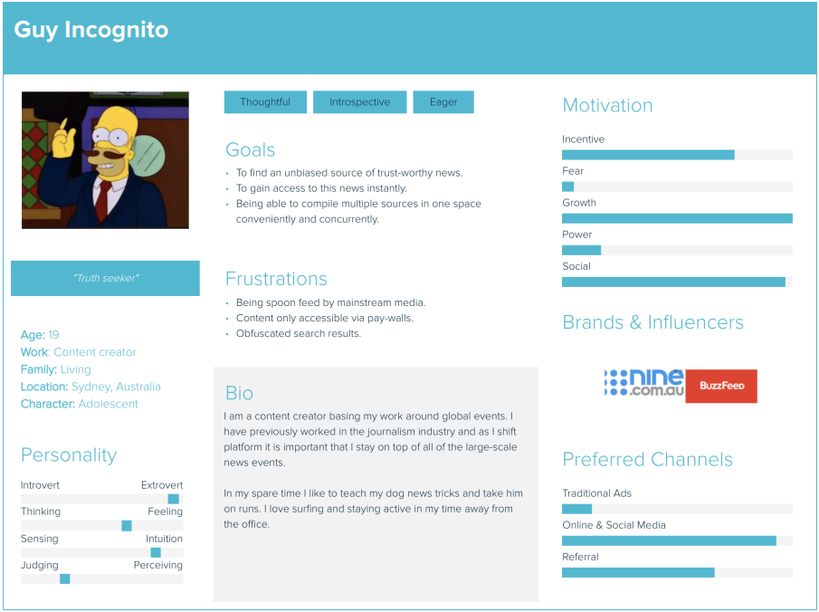

1- Guy is a young entrepreneur working from his home office in Sydney. He bases his content around concurrent global events, specifically on international matters and political turmoil. Coming from a background in journalism Guy understands the importance of stying up-to-date with the news-flow and appreciates applications that can provide  constant stream. As Guy grows tired of pay-walls and obfuscated search results he has begun his search for a new application.

Guy is seeking an application to provide him with a source of unbiased news that he can gain access to instantly and freely. He is also eager for the application to compile multiple articles in a saved space for his convenience.

##### User 1. Huilius Jibert
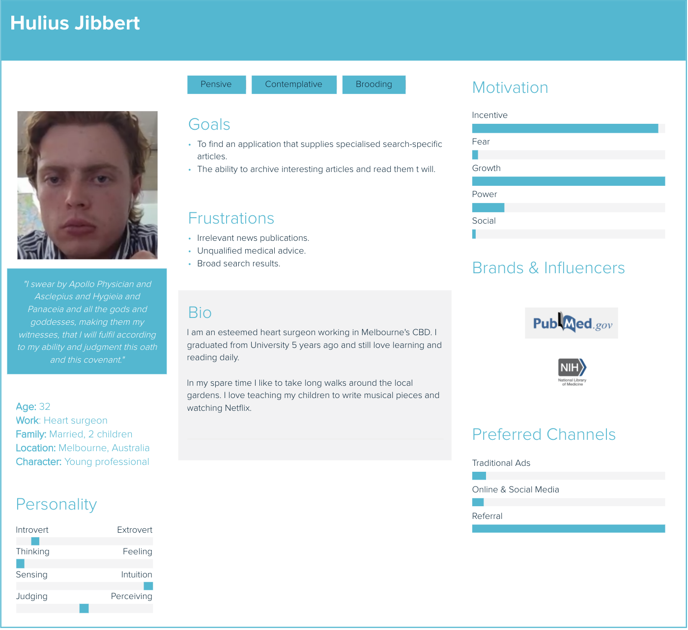

2- Hulius is a successful young heart surgeon working in the heart of the Melbourne CBD. He is an avid learner and hasn’t put a book down since completing his studies at university. With his constant craving for new knowledge and material Hulius has grown tired of regular mainstream media outlets and is looking for a refreshing new way to find articles.

Hulius is seeking an application with specific search results that can scour the web for medical articles from qualified and esteemed publications. He isn’t interested in irrelevant articles and unqualified advice. Hulius would also like an archive function where he can save fascinating articles to revisit later.

##### User 3. John Smith
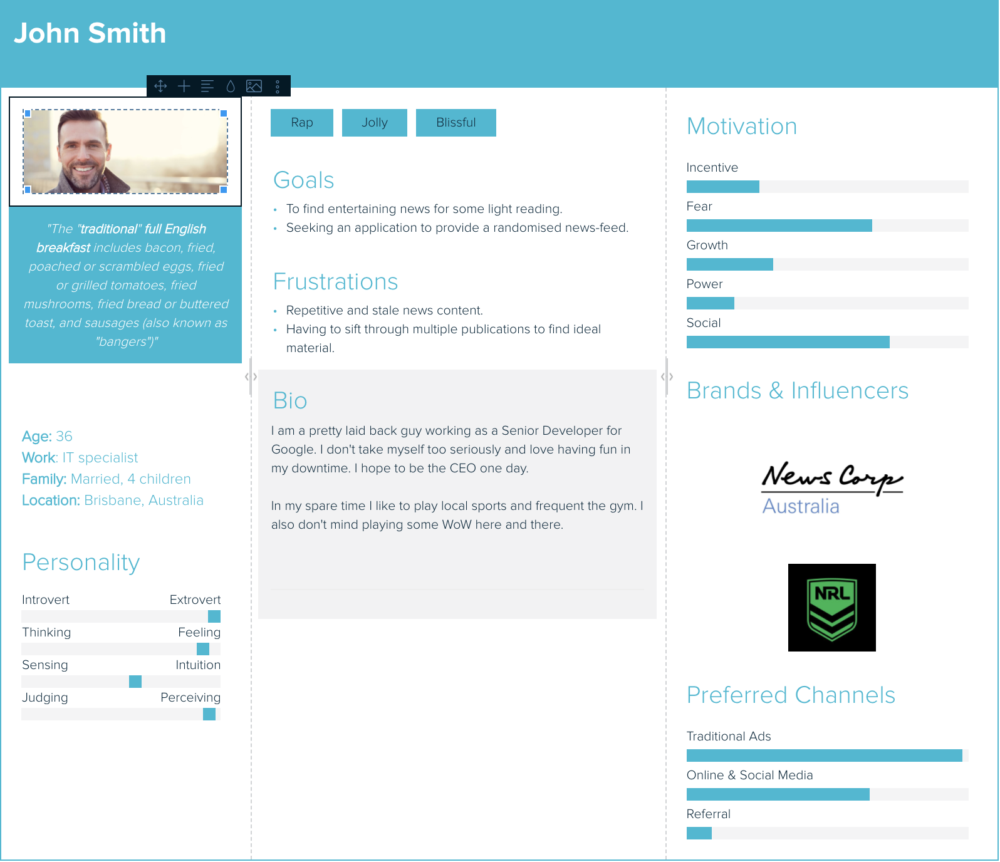

3- John is a young go getter living his life to the fullest. Working out of his IT office in Brisbane John tackles life head on and has an insatiable appetite for consuming media. Bored with the staleness of his current favourite news publications John is searching for an application to refresh his love for the news.

John wants an application that can house a refreshing news feed for his own entertainment. He doesn’t want to have to sift through multiple publications to find differing news stories and has his sights set on a randomised news feed that won’t show him the same content daily.

### Wireframes

##### Home Page

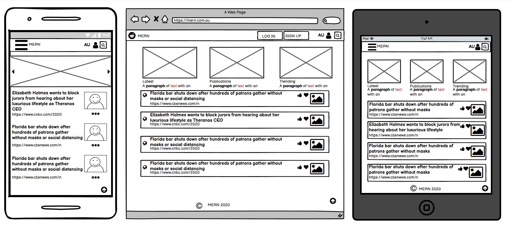

##### Main Page

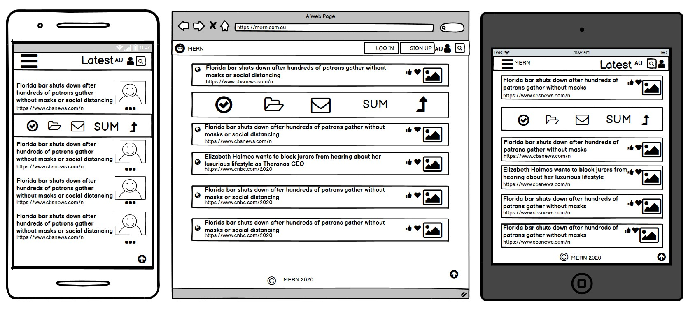

##### Archive

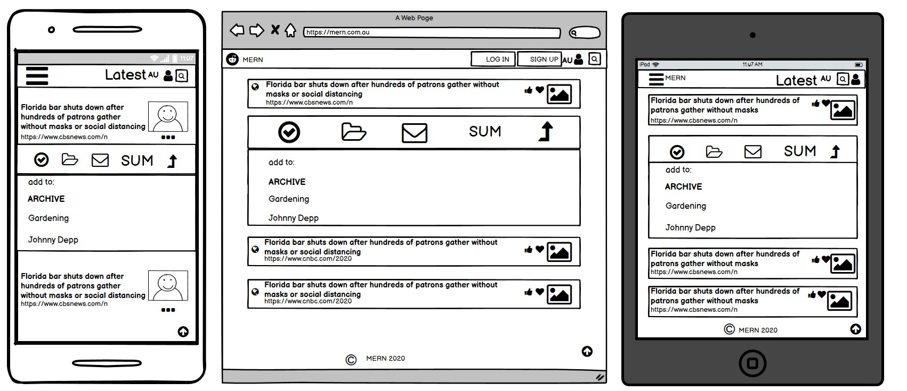

##### Log In

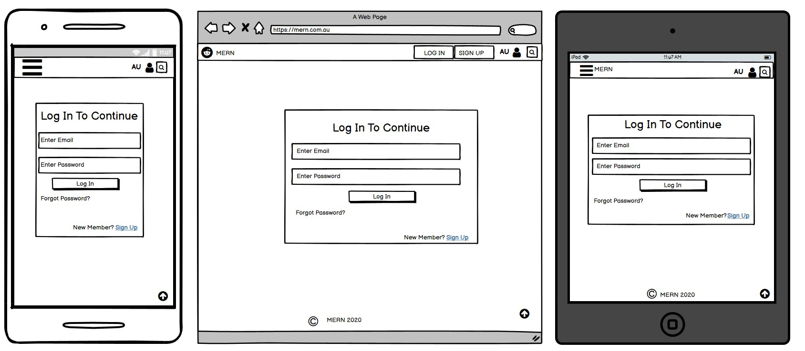

##### Sign In

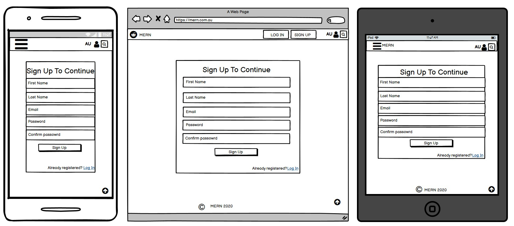

##### Profile

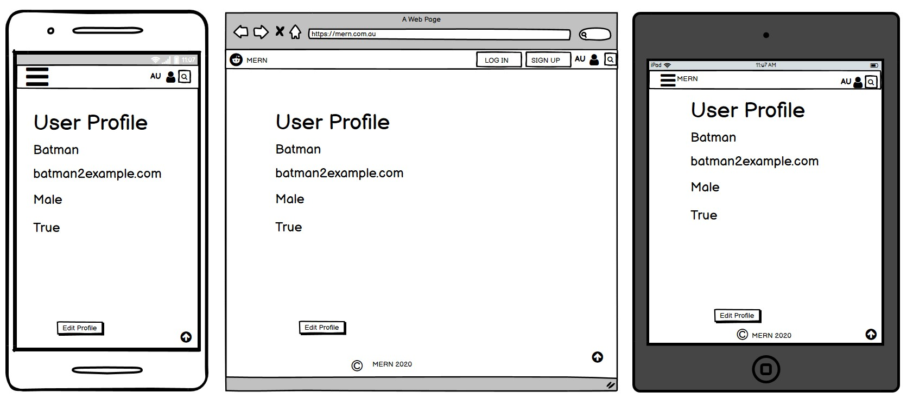

##### Dropdown Menu

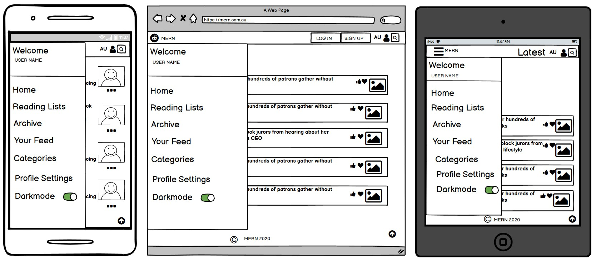

##### Archive Settings

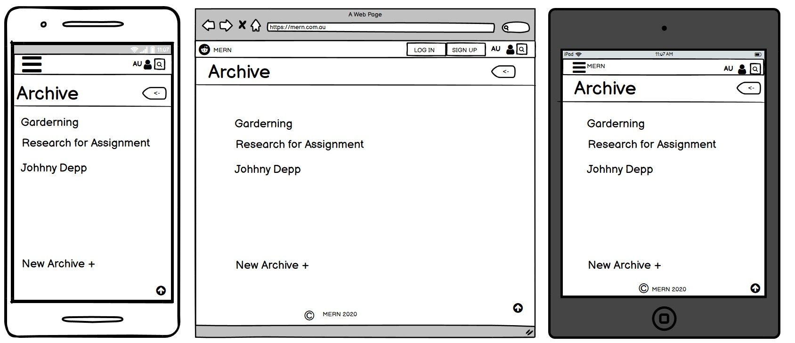

##### Profile Settings

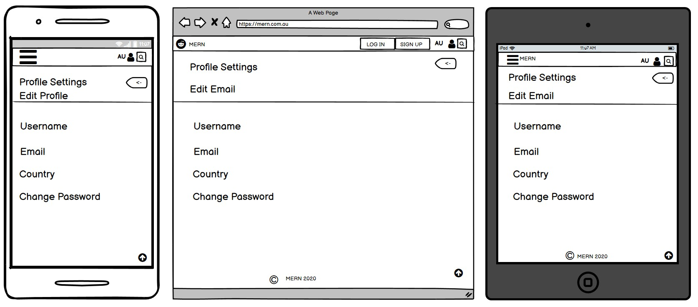

##### Categories

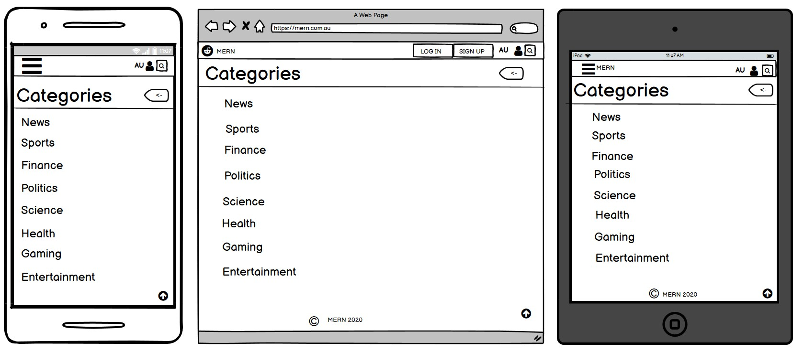

##### Publications

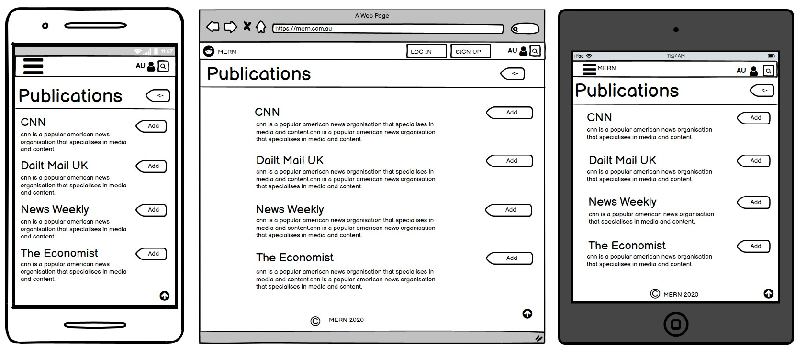

### Trello Board

https://trello.com/b/vf59LrM7/mern-news-application

