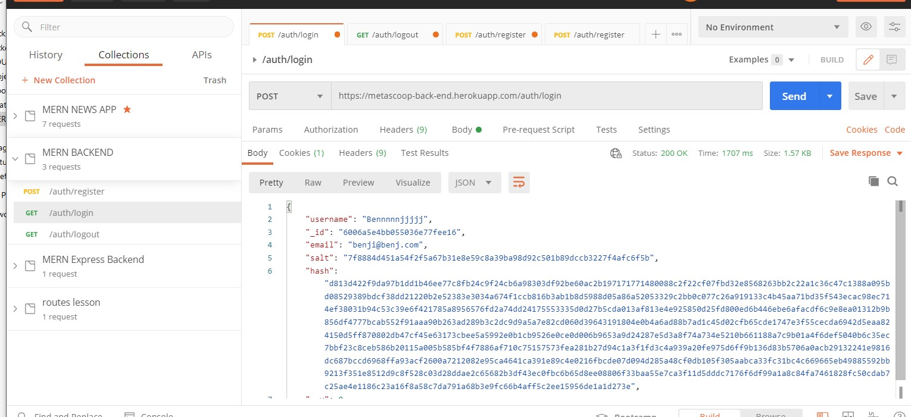

# Back end testing overview

Backend testing was performed manually using postman to test and verify authentication routes. Unfortunately the testing is limited in scope as there were many hurdles and time constraints in creating a usable back end.

In testing the backend we were able to successfully create, authenticate and login new users, as can be seen here:

